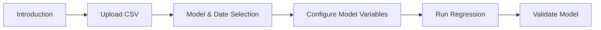

# Regressly

**A Streamlit application for simplifying and automating regression analysis.**

[](https://regressly-lmg-services.streamlit.app)
[](https://github.com/Levi-Gagne/regressly.git)

Regressly is a user-friendly web application that guides you through the entire regression modeling process, from data upload to model validation. Built with [Streamlit](https://streamlit.io/), Regressly consolidates complex econometric tasks into easy steps so you can focus on insights.

## Table of Contents

1. [Features](#features)  
2. [App Architecture](#app-architecture)  
3. [Quickstart Guide](#quickstart-guide)  
4. [Usage](#usage)  
5. [Repository Structure](#repository-structure)  
6. [Contributing](#contributing)  
7. [License](#license)  

## Features

- **Multiple Regression Methods**  
  Currently supports Linear Regression, Logistic Regression, Lasso Regression, and more. Easily extended for additional econometric or machine learning models.

- **Step-by-Step Workflow**  
  Organized into several steps for clarity:
  1. **Introduction** – Overview of available models (their Y and X variable types, plus additional requirements).  
  2. **Upload CSV** – Easily upload your dataset directly from your local machine.  
  3. **Model & Date Selection** – Specify which model to run and select your date ranges or relevant timescale.  
  4. **Configure Model Variables** – Pick dependent and independent variables, and provide optional hyperparameters.  
  5. **Run Regression** – Execute your chosen model and retrieve the results.  
  6. **Validate Model** – (Optional) Provide additional checks or diagnostics for your model.

- **Dynamic Module Loading**  
  Each model is encapsulated in its own module, making it easy to maintain or add new models (e.g., `run_linear_regression.py`, `run_logistic_regression.py`, `run_lasso_regression.py`).

- **Lightweight and Extensible**  
  Runs on Streamlit, enabling interactive dashboards with minimal overhead and real-time reactivity.

- **JSON-Based Configuration**  
  Key selections (e.g., model type, date range) are stored in JSON files to simplify data passing between steps.

## App Architecture



- **Introduction**: Presents a table of available models, their inputs, and usage.  
- **Upload CSV**: Handles file upload and parsing for further steps.  
- **Model & Date Selection**: Saves chosen model type and date parameters into a JSON file.  
- **Configure Model Variables**: Dynamically loads widgets for the chosen model, letting you specify features/parameters.  
- **Run Regression**: Executes the regression using the chosen model.  
- **Validate Model**: Provides optional post-regression checks (e.g., metrics, visual diagnostics, etc.).

## Quickstart Guide

1. **Clone the Repository**  
   ```bash
   git clone https://github.com/Levi-Gagne/regressly.git
   cd regressly
   ```

2. **Create/Activate a Virtual Environment** (recommended)  
   ```bash
   python3 -m venv venv
   source venv/bin/activate  # On macOS/Linux
   # or venv\Scripts\activate for Windows
   ```

3. **Install Dependencies**  
   ```bash
   pip install -r requirements.txt
   ```

4. **Run the App**  
   ```bash
   streamlit run app.py
   ```
   Open the provided local URL (e.g., `http://localhost:8501`) in your browser to access the Regressly UI.

## Usage

### 1. Introduction
Visit the **Introduction** tab in the sidebar to see a detailed table of the available models. Each row indicates:
- **Model Name**  
- **Dependent Variable Type**  
- **Independent Variables**  
- **Other Required Inputs**

### 2. Upload CSV
Click **Step 1: Upload CSV**. Drag and drop or select your `.csv` file. The app will temporarily store it for further processing.

### 3. Model & Date Selection
Under **Step 2: Model & Date Selection**:
- Choose your regression model (e.g., Linear, Logistic, Lasso, etc.).
- (Optional) Provide a date range to filter the data (useful for time-series models).

### 4. Configure Model Variables
Under **Step 3**:
- Select your dependent (Y) and independent (X) variables.
- Provide additional parameters if required (e.g., `alpha` for Lasso).

### 5. Run Regression
**Step 4**:
- Click “Run [ModelName]” to execute the regression.
- The result (like coefficients, R-squared, or classification metrics) will be displayed.

### 6. Validate Model
**Step 5**:
- (Optional) Click **Validate Model** for post-model diagnostics or advanced checks.  
  *Note: This step may vary depending on the model’s validation script.*

## Repository Structure

```text
regressly/
├── app.py                           # Main Streamlit application
├── requirements.txt                 # Dependencies
├── econometric_data/
│   ├── upload_file.py               # CSV upload logic
│   ├── model_date_selection.py      # Model/date selection
│   ├── select_model_variables.py    # Dynamic variable selection & validation
│   └── econometric_modes/
│       ├── run_linear_regression.py
│       ├── run_logistic_regression.py
│       ├── run_lasso_regression.py
│       ├── validation_linear_regression.py
│       ├── validation_logistic_regression.py
│       └── ... (additional model scripts)
└── uploaded_files/                  # Folder where uploaded CSVs are saved
```

- **`app.py`** – Orchestrates the Streamlit interface and navigation.  
- **`econometric_data/`** – Houses code for file handling, model selection, and variable configuration.  
- **`econometric_modes/`** – Collection of regression and validation modules for various models.

## Contributing

We welcome contributions! To get involved:

1. Fork the repo and create a new branch.
2. Implement your changes and add tests where applicable.
3. Submit a pull request describing your changes in detail.

## License

This project is open-source and available under the [MIT License](LICENSE). Feel free to modify and distribute as permitted.

**Access the Live App:**  
[Regressly @ Streamlit](https://regressly-lmg-services.streamlit.app)

**Visit the GitHub Repo:**  
[Levi-Gagne / regressly](https://github.com/Levi-Gagne/regressly.git)

*Thank you for using Regressly! We hope it simplifies your modeling workflow and fosters clearer insights.*
